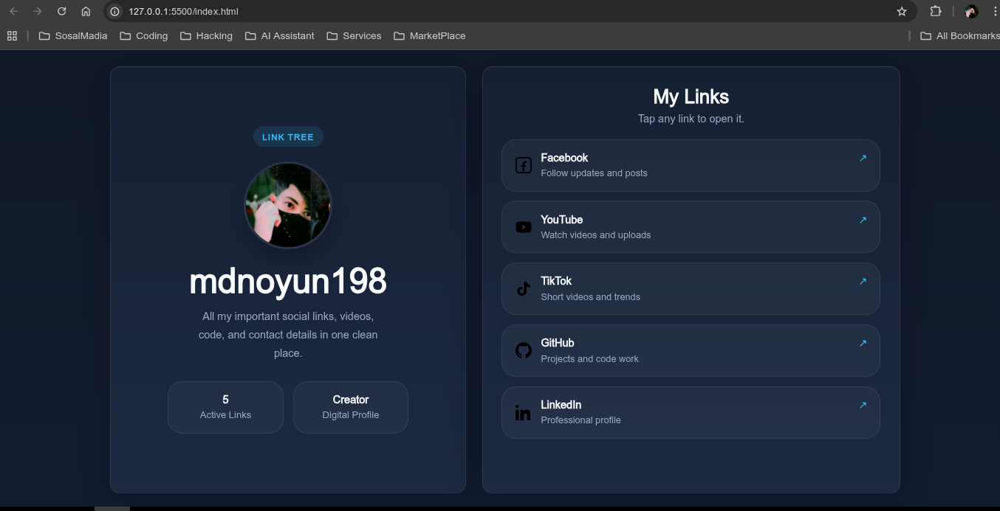
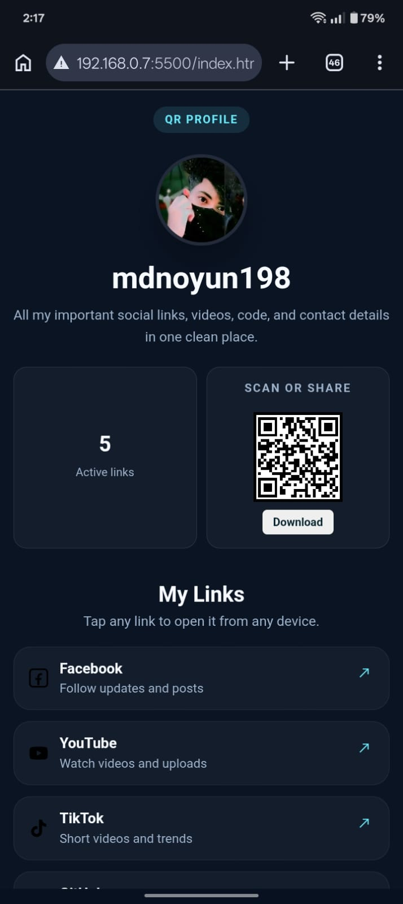

# 🌐 Link Tree

<p align="center">
  <b>A clean, modern, and responsive Link Tree profile page</b><br>
  Built with HTML, CSS, and JavaScript 🚀
</p>

<p align="center">
  Organize all your important links in one place — perfect as a digital visiting card.
</p>

---

## ✨ Features

* 📱 Fully responsive (mobile, tablet, desktop)
* 👤 Profile section (avatar, bio, stats)
* 🔗 Clean & minimal link cards
* ⚡ Dynamic links from `links.json` (no HTML editing)
* 📷 QR code generation (SVG download)
* 🖨️ Print-ready QR for cards & posters

---

## 📸 Preview

### 💻 Desktop

<table>
  <tr>
    <td width="75%">
      
    </td>
    <td width="35%">
      
    </td>
  </tr>
</table>

## 📁 Project Structure

```text
LinkTree/
├── index.html
├── style.css
├── script.js
├── links.json
└── img/
```

---

## ➕ Add New Links

Edit `links.json`:

```json
{
  "Name": "Facebook",
  "description": "Follow updates",
  "URL": "https://facebook.com/yourprofile",
  "Icon": "img/facebook.svg"
}
```

✔ Save → Refresh → Done

---

## 📷 QR Code

* Auto-generates from your page URL
* Download as **SVG** (high quality)
* Use for:

  * Business cards
  * Posters
  * Stickers

👉 Scan → Opens your Link Tree instantly

---

## 🚀 Run Locally

```bash
python3 -m http.server 8000
```

Open: http://localhost:8000

---

## 🌍 Deploy

* GitHub Pages
* Netlify
* Vercel

After deploy:

1. Copy URL
2. Generate QR
3. Share 🔥

---

## 🛠️ Tech Stack

* HTML
* CSS
* JavaScript
* JSON

---

## 💡 Tips

* Edit only `links.json`
* Use SVG icons
* Keep text short & clean

---

## 📌 Future Improvements

* 🌙 Dark mode
* 📊 Analytics
* 🎨 Themes
* 🔀 Drag & sort links

---

## ⭐ Support

If you like it, give a star ⭐

